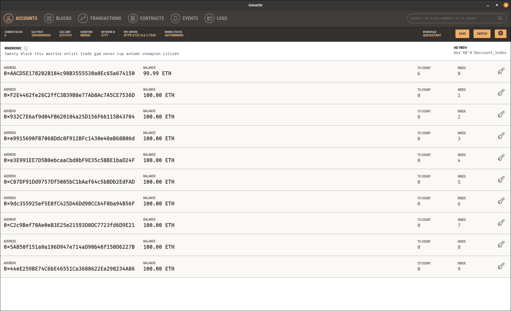

= Exercise 03
Florian Weingartshofer
:source-highlighter: rouge
:author: Florian Weingartshofer
:rouge-style: github

== Creation of a Truffle Project

[source,bash]
----
npm init
npm i @openzeppelin/contracts
npm i truffle
npx truffle init
----

== Contract & Migration

.Token
[source,solidity]
----
include::./contracts/Floken.sol[]
----

.`truffle-config.js`
[source,javascript]
----
include::./truffle-config.js[]
----

== Running on a Local Chain

image::img/deployed-contracts.png[]

