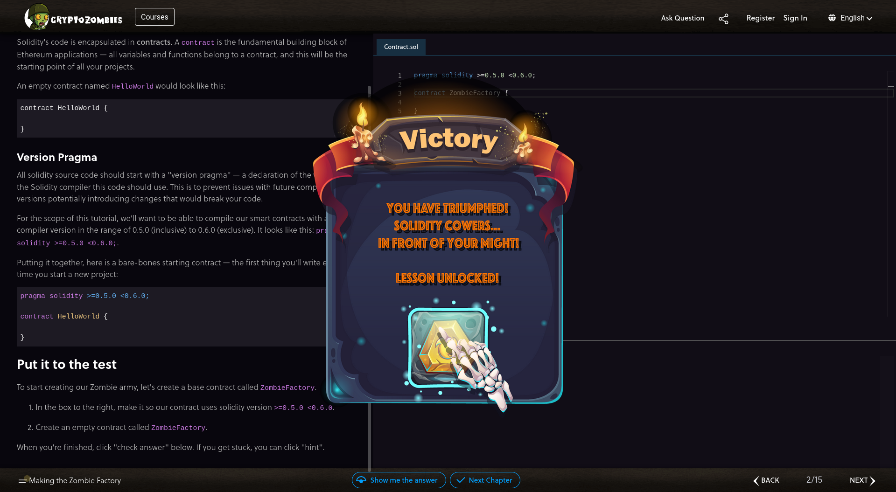

= Exercise 04
Florian Weingartshofer
:source-highlighter: rouge
:author: Florian Weingartshofer
:rouge-style: github

.100%

== Lesson 01
.01

.02

.03

.04

.05

.06

.07

.08

.09

.10

.11

.12

.13

.14

== Lesson 02

.02

.03

.04

.05

.06

.07

.08

.09

.10

.11

.12

.13

.14

.15

== Lesson 03

.01

.02

.03

.04

.05
image::img/03/image-2023-05-16-14-57-29-592.png[]

.06

.07

.08

.09

.10

.11

.12

.13

== Lesson 04

.01
image::img/04/image-2023-05-16-15-17-42-022.png[]

.02

.03

.04

.05

.06

.07
image::img/04/image-2023-05-16-15-27-10-026.png[]

.08

.09

.10

.11

.12

.13

== Lesson 05

.01

.02

.03

.04

.05

.06

.07
image::img/05/image-2023-05-25-08-26-52-767.png[]

.08

.09

.10

.11

.12

.13

.15

== Lesson 06

.01

.02

.03

.04

.05

.06

.07

.08

.09

.10

.11

